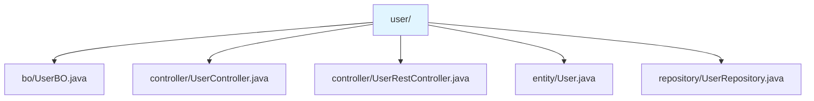
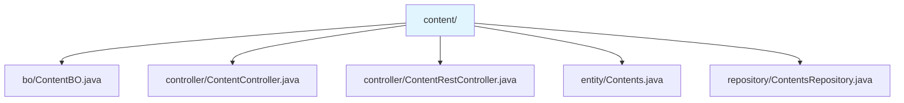
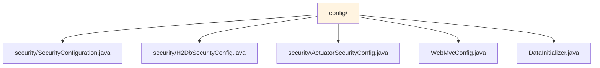
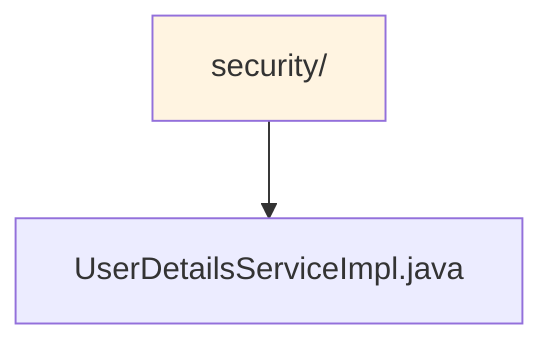
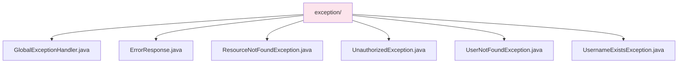
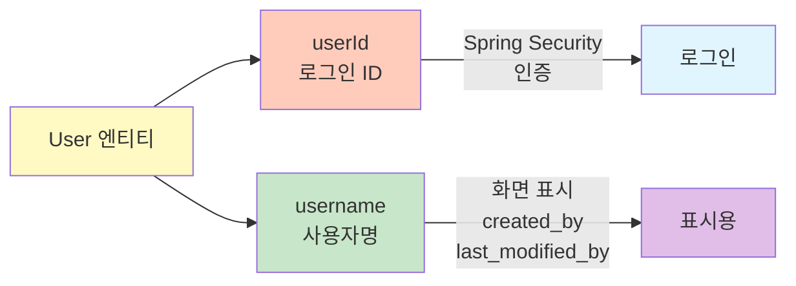
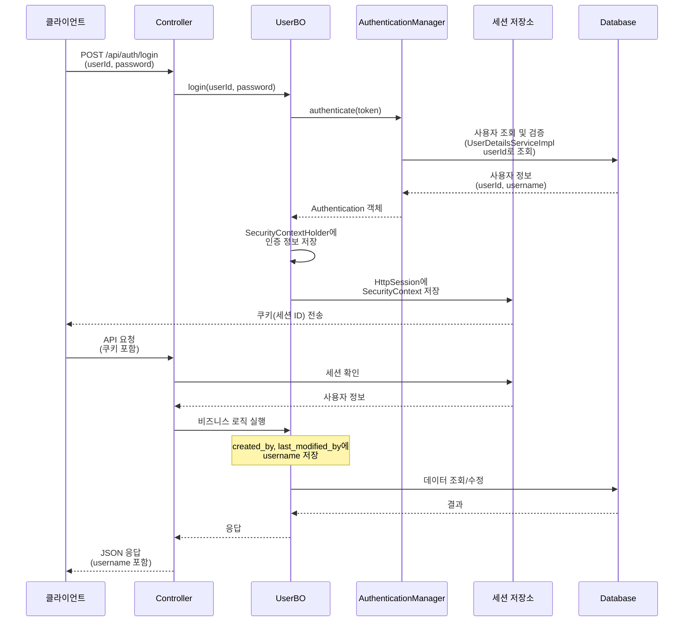
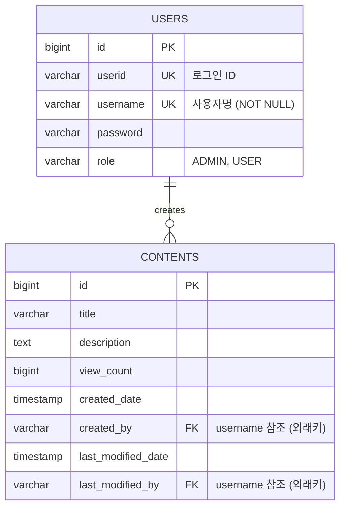

# CMS Backend API

2026 신입 Back-End 개발자 코딩 과제 - 간단한 CMS REST API

## 기술 스택

- **Java 25**
- **Spring Boot 4.0.3**
- **Spring Security** (인증 및 권한 관리)
- **Spring Data JPA** (데이터베이스 접근)
- **H2 Database** (파일 기반, 영구 저장)
- **Lombok**

- **Bootstrap 5** (프론트엔드 UI)
- **UTF-8 인코딩** (모든 소스 코드 및 리소스 파일)

## 프로젝트 실행 방법

### 1. 빌드
```bash
./gradlew build
```

### 2. 실행
```bash
./gradlew bootRun
```

애플리케이션은 `http://localhost:8080`에서 실행됩니다.

--------

## 프로젝트 실행화면

### 관리자 로그인


### 글작성


### 사용자 로그인


### 사용자 글 수정 및 삭제


-----

### 초기 계정

프로젝트 실행 시 다음 계정이 자동으로 생성됩니다 (`DataInitializer`에 의해):

- **Admin 계정**
  - UserID: `admin` (로그인 ID)
  - Username: `관리자` (사용자명)
  - Password: `password`
  - Role: `ADMIN`
  - 권한: 모든 콘텐츠 수정/삭제 가능

- **User 계정**
  - UserID: `user1`, `user2` (로그인 ID)
  - Username: `사용자1`, `사용자2` (사용자명)
  - Password: `password`
  - Role: `USER`
  - 권한: 본인이 작성한 콘텐츠만 수정/삭제 가능

> **참고**: 
> - **UserID**: 로그인 시 사용하는 고유 ID (필수, unique, not null)
> - **Username**: 화면에 표시되는 사용자명 (필수, unique, not null) - 회원가입 시 필수 입력 필드

> **참고**: 계정이 이미 존재하면 자동 생성되지 않습니다. 데이터베이스 파일(`./data/cmsdb.mv.db`)을 삭제하면 초기화됩니다.

## 구현 내용 / 추가 구현 기능

### 주요 기능

#### 인증 및 권한 관리
- **Session 기반 인증**
  - Spring Security 기본 세션 인증 방식
  - 쿠키 기반 세션 관리 (브라우저 자동 처리)
  - 세션에 사용자 인증 정보 저장
  - 모든 API 요청 시 쿠키(세션 ID) 자동 포함
- **UserID와 Username 분리**
  - **UserID**: 로그인 시 사용하는 고유 ID (필수, unique, not null)
  - **Username**: 화면에 표시되는 사용자명 (필수, unique, not null)
  - Spring Security는 UserID를 사용하여 인증 처리
  - 콘텐츠의 `created_by`, `last_modified_by`는 User 엔티티와 외래키로 연결되어 Username 저장
- **Role 기반 권한 관리** (ADMIN, USER)
- **회원가입 및 로그인** 기능 (UserID로 로그인)
- **로그아웃** 기능
- **UserID 중복 확인** API

#### 콘텐츠 관리
- 콘텐츠 CRUD 작업
- 페이징 지원 (페이지 번호 버튼 포함)
- 조회수 자동 증가 기능
- 작성자/수정자 정보 자동 기록
  - `created_by`: 콘텐츠 생성 시 현재 로그인한 사용자의 Username 저장 (수정 불가, `updatable = false`)
  - `last_modified_by`: 콘텐츠 수정 시 현재 로그인한 사용자의 Username 저장
  - 조회수 증가 시 `last_modified_by`는 변경되지 않음
  - 관리자가 수정한 경우에도 원래 작성자는 유지되고, 수정자만 관리자로 업데이트됨
- 권한 기반 접근 제어:
  - 작성자 본인만 수정/삭제 가능
  - ADMIN은 모든 콘텐츠 수정/삭제 가능
  - 프론트엔드에서 권한에 따라 버튼 표시/숨김

#### 프론트엔드
- Bootstrap 5 다크 모드 UI
- 반응형 디자인
- 로그인 상태에 따른 네비게이션 바 자동 업데이트
- 로그인한 사용자 인사말 표시 ("~님 안녕하세요")
- 권한에 따른 Edit/Delete 버튼 표시 제어
- 페이징 UI (페이지 번호, Previous/Next 버튼)
- 작성자 컬럼에 Username 표시 (UserID가 아닌 사용자명)

#### 예외 처리
- 전역 예외 처리 (`GlobalExceptionHandler`)
- 커스텀 예외 클래스
  - `ResourceNotFoundException` (404)
  - `UnauthorizedException` (403)
  - `UserNotFoundException` (404)
  - `UsernameExistsException` (409)
- 표준화된 에러 응답 형식

#### 기술적 해결 사항
- **순환 참조 해결**: `UserBO`와 `AuthenticationManager` 간 순환 참조는 실제로 발생하지 않아 `@Lazy` 어노테이션 없이 해결됨. `UserDetailsService` 구현을 별도 클래스(`UserDetailsServiceImpl`)로 분리하여 의존성 분리
- **세션 생성**: 로그인 시 `SecurityContextHolder`와 `HttpSessionSecurityContextRepository`를 사용하여 세션에 인증 정보 저장
- **viewCount 기본값 처리**: 콘텐츠 생성 시 `viewCount`가 null인 경우 자동으로 0으로 설정
- **UserID와 Username 분리**: 
  - `UserDetails.getUsername()`은 Spring Security 호환을 위해 UserID를 반환
  - 실제 사용자명은 `getActualUsername()` 메서드로 접근
  - Username은 필수 필드(NOT NULL, UNIQUE)로 변경하여 데이터 무결성 보장
- **엔티티 관계 매핑**: 
  - `Contents.created_by`, `Contents.last_modified_by`는 `User` 엔티티와 `@ManyToOne` 관계로 연결
  - 외래키는 `username` 컬럼을 참조 (`@JoinColumn(referencedColumnName = "username")`)
  - `FetchType.LAZY`로 지연 로딩하여 성능 최적화
  - `@EntityGraph`를 사용하여 목록 조회 시 User 엔티티를 함께 로드하여 LAZY 로딩 문제 해결
  - `@JsonIgnore`로 User 객체는 JSON 직렬화에서 제외하고, `getCreatedBy()` 메서드로 username 문자열만 반환
  - `@Getter(AccessLevel.NONE)`로 Lombok getter 충돌 방지
  - `@JsonProperty`로 JSON 직렬화 명시
  - `created_by` 필드에 `updatable = false` 설정하여 작성자는 수정 불가 (데이터 무결성 보장)
- **Password 필드 보안 처리**: 
  - `User.password` 필드에 `@JsonProperty(access = JsonProperty.Access.WRITE_ONLY)` 적용
  - 요청(로그인/회원가입) 시 password는 받을 수 있지만, 응답 시에는 제외되어 보안 강화
- **조회수 증가 시 수정일 미변경**: `@Modifying` 쿼리를 사용하여 조회수만 증가시키고 `lastModifiedDate`는 변경되지 않도록 처리
- **BO 패턴 통일**: 
  - `ContentBO`를 `UserBO`와 동일한 패턴으로 리팩토링
  - Entity를 직접 반환하도록 변경 (Entity 감싸기 제거)
  - 비즈니스 로직만 처리하고, 편의 메서드는 Entity에 포함
- **Entity 필드명 카멜케이스 통일**: 
  - 모든 Entity 필드명을 카멜케이스로 통일 (예: `userid` → `userId`)
  - 데이터베이스 컬럼명은 스네이크 케이스 유지 (`@Column(name = "userid")`)
  - Java 네이밍 컨벤션 준수
- **Lombok @Data 어노테이션 사용**: 
  - `@Getter`, `@Setter` 대신 `@Data` 어노테이션 사용
  - `@Data`는 `@Getter`, `@Setter`, `@ToString`, `@EqualsAndHashCode`, `@RequiredArgsConstructor`를 포함하여 코드 간결화
- **User 엔티티가 UserDetails 직접 구현**: 
  - `UserPrincipal` 래퍼 클래스 제거
  - `User` 엔티티가 직접 `UserDetails` 인터페이스를 구현하여 Spring Security와 통합
  - 코드 단순화 및 구조 개선
- **데이터 무결성 보장**: 
  - `Contents.created_by` 필드에 `updatable = false` 설정하여 작성자는 절대 변경되지 않도록 보호
  - 관리자가 수정해도 원래 작성자 정보는 유지되고, 수정자만 업데이트됨
- **프론트엔드 개선**: 
  - 모든 HTML 템플릿의 영어 텍스트를 한국어로 변경하여 사용자 경험 향상
  - 사용자명을 필수 입력 필드로 변경하여 데이터 무결성 강화
  - 수정일 표시 형식 개선: "수정일: YYYY-MM-DD (수정자명)" 형식으로 표시

### 아키텍처

본 프로젝트는 **Controller → BO → Repository → Entity** 4계층 구조로 구성되어 있습니다.

```mermaid
graph TB
    Client[클라이언트] --> Controller[Controller]
    Controller --> BO[BO<br/>@Service]
    BO --> Repository[Repository]
    Repository --> DB[(H2 Database)]
    BO --> Entity[Entity<br/>@Data]
    
    subgraph Controller
        PageController[@Controller<br/>HTML 페이지]
        RestController[@RestController<br/>REST API]
    end
    
    subgraph User[User 엔티티<br/>UserDetails 구현]
        UserID[userId<br/>로그인 ID]
        Username[username<br/>사용자명]
    end
    
    Controller -.->|인증 정보| User
    BO -.->|created_by<br/>last_modified_by| Username
    
    style Controller fill:#e1f5ff
    style BO fill:#fff4e1
    style Repository fill:#e8f5e9
    style Entity fill:#fce4ec
    style DB fill:#f3e5f5
    style User fill:#fff9c4
    style UserID fill:#ffccbc
    style Username fill:#c8e6c9
```

- **Controller**: 요청/응답 처리
  - `Controller`: HTML 페이지 제공 (`@Controller`)
  - `RestController`: REST API 엔드포인트 제공 (`@RestController`)
- **BO (Business Object)**: `@Service`로 비즈니스 로직 처리, Repository 직접 호출
- **Repository**: 데이터베이스 접근 (Spring Data JPA)
- **Entity**: `@Data`로 데이터 구조 정의 (카멜케이스 필드명, UserDetails 직접 구현)

### 프로젝트 구조 (Feature별 구성)

본 프로젝트는 Feature별로 패키지를 구성하여 각 기능의 Controller, BO, Repository, Entity를 하나의 패키지에 모아 관리합니다.

#### 1. user 패키지 (사용자 관련 기능)



**구성 요소:**
- `bo/UserBO.java`: `@Service` - 로그인, 회원가입, 사용자 조회 등 비즈니스 로직 처리
- `controller/UserController.java`: `@Controller` - 로그인/회원가입 HTML 페이지 제공
- `controller/UserRestController.java`: `@RestController` - 사용자 관련 REST API 엔드포인트
- `entity/User.java`: `@Data` - 사용자 데이터 엔티티 (`UserDetails` 직접 구현, userId, username, password, role)
- `repository/UserRepository.java`: Spring Data JPA Repository - 사용자 데이터 접근

**주요 기능:**
- UserID 기반 로그인/회원가입
- UserID 중복 확인
- 사용자 정보 조회

#### 2. content 패키지 (콘텐츠 관련 기능)



**구성 요소:**
- `bo/ContentBO.java`: `@Service` - 콘텐츠 CRUD 비즈니스 로직 처리
- `controller/ContentController.java`: `@Controller` - 콘텐츠 목록/상세/작성/수정 HTML 페이지 제공
- `controller/ContentRestController.java`: `@RestController` - 콘텐츠 관련 REST API 엔드포인트
- `entity/Contents.java`: `@Data` - 콘텐츠 데이터 엔티티 (title, description, viewCount, created_by, last_modified_by 등)
- `repository/ContentsRepository.java`: Spring Data JPA Repository - 콘텐츠 데이터 접근

**주요 기능:**
- 콘텐츠 CRUD 작업
- 페이징 처리
- 조회수 자동 증가
- 작성자/수정자 정보 자동 기록
- 권한 기반 접근 제어

#### 3. config 패키지 (설정 클래스)



**구성 요소:**
- `security/SecurityConfiguration.java`: Spring Security 설정 (세션 기반 인증, 권한 관리)
- `security/H2DbSecurityConfig.java`: H2 데이터베이스 콘솔 접근 설정
- `security/ActuatorSecurityConfig.java`: Spring Actuator 보안 설정
- `WebMvcConfig.java`: 웹 MVC 설정 (인터셉터, 리소스 핸들러 등)
- `DataInitializer.java`: 애플리케이션 시작 시 초기 데이터 생성 (Admin/User 계정)

**주요 기능:**
- Spring Security 세션 기반 인증 설정
- H2 콘솔 접근 권한 설정
- 초기 계정 자동 생성

#### 4. security 패키지 (Security 관련)



**구성 요소:**
- `UserDetailsServiceImpl.java`: `UserDetailsService` 구현체 - UserID 기반 사용자 조회 (순환 참조 해결)

**주요 기능:**
- Spring Security와 User 엔티티 연결
- UserID 기반 인증 처리
- User 엔티티가 직접 `UserDetails` 인터페이스를 구현하여 Spring Security와 통합

#### 5. exception 패키지 (예외 처리)



**구성 요소:**
- `GlobalExceptionHandler.java`: `@ControllerAdvice` - 전역 예외 처리 핸들러
- `ErrorResponse.java`: 표준화된 에러 응답 형식
- `ResourceNotFoundException.java`: 리소스를 찾을 수 없을 때 발생 (404)
- `UnauthorizedException.java`: 권한이 없을 때 발생 (403)
- `UserNotFoundException.java`: 사용자를 찾을 수 없을 때 발생 (404)
- `UsernameExistsException.java`: UserID/Username 중복 시 발생 (409)

**주요 기능:**
- 전역 예외 처리 및 표준화된 에러 응답
- HTTP 상태 코드 매핑
- 에러 메시지 일관성 유지

#### 디렉토리 구조

```
src/main/java/com/malgn/
├── user/                    # 사용자 관련 기능
│   ├── bo/
│   │   └── UserBO.java
│   ├── controller/
│   │   ├── UserController.java
│   │   └── UserRestController.java
│   ├── entity/
│   │   └── User.java
│   └── repository/
│       └── UserRepository.java
│
├── content/                 # 콘텐츠 관련 기능
│   ├── bo/
│   │   └── ContentBO.java
│   ├── controller/
│   │   ├── ContentController.java
│   │   └── ContentRestController.java
│   ├── entity/
│   │   └── Contents.java
│   └── repository/
│       └── ContentsRepository.java
│
├── config/                  # 설정 클래스
│   ├── security/
│   │   ├── SecurityConfiguration.java
│   │   ├── H2DbSecurityConfig.java
│   │   └── ActuatorSecurityConfig.java
│   ├── WebMvcConfig.java
│   └── DataInitializer.java
│
├── security/                # Security 관련
│   └── UserDetailsServiceImpl.java
│
└── exception/               # 예외 처리
    ├── GlobalExceptionHandler.java
    ├── ErrorResponse.java
    ├── ResourceNotFoundException.java
    ├── UnauthorizedException.java
    ├── UserNotFoundException.java
    └── UsernameExistsException.java

src/main/resources/
├── templates/               # HTML 템플릿 파일
│   ├── user/
│   │   ├── login.html
│   │   └── signup.html
│   └── content/
│       ├── contents.html
│       ├── content-new.html
│       ├── content-detail.html
│       └── content-edit.html
└── application.yml          # 애플리케이션 설정
```

### 설계 원칙

```mermaid
graph LR
    A[Controller] -->|Entity 직접 전달| B[BO<br/>@Service<br/>@Transactional]
    B -->|Repository 호출| C[Repository<br/>@EntityGraph]
    C -->|Entity 반환| D[(Database)]
    B -->|Entity 사용| E[Entity<br/>@Data<br/>편의 메서드]
    
    subgraph User[User 엔티티]
        U1[userId<br/>로그인 ID]
        U2[username<br/>사용자명]
    end
    
    subgraph Content[Contents 엔티티]
        C1[createdBy<br/>User 엔티티]
        C2[lastModifiedBy<br/>User 엔티티]
        C3[getCreatedBy<br/>username 반환]
        C4[getLastModifiedBy<br/>username 반환]
    end
    
    B -.->|getActualUsername| U2
    B -.->|setCreatedByUser<br/>setLastModifiedByUser| C1
    B -.->|setCreatedByUser<br/>setLastModifiedByUser| C2
    E -.->|JSON 직렬화| C3
    E -.->|JSON 직렬화| C4
    
    style A fill:#e1f5ff
    style B fill:#fff4e1
    style C fill:#e8f5e9
    style E fill:#fce4ec
    style D fill:#f3e5f5
    style User fill:#fff9c4
    style Content fill:#e1bee7
```

1. **Service 레이어 제거**: BO가 비즈니스 로직과 Repository 호출을 모두 담당
   - 전통적인 Service 레이어를 제거하고 BO(Business Object)로 통합
   - `@Service` 어노테이션으로 Spring Bean 등록
   - 비즈니스 로직과 데이터 접근 로직을 하나의 레이어에서 처리

2. **DTO 제거**: Controller에서 Entity를 직접 받아 사용
   - DTO(Data Transfer Object) 레이어 제거로 코드 단순화
   - Controller에서 `@RequestBody`로 Entity를 직접 받음
   - Entity에 `@Valid` 어노테이션으로 검증 처리

3. **Feature별 패키지 구조**: user, content 등 기능별로 모든 레이어를 묶어 관리
   - 각 기능(user, content)별로 Controller, BO, Repository, Entity를 하나의 패키지에 구성
   - 기능별 응집도 향상 및 코드 탐색 용이성 증대
   - 수평적 확장이 쉬운 구조

4. **BO는 @Service + @Transactional**: 비즈니스 로직 처리 및 트랜잭션 관리
   - `@Service`로 비즈니스 로직 처리 및 Repository 직접 호출
   - `@Transactional`로 트랜잭션 경계 설정 및 LAZY 로딩 초기화 보장
   - 권한 확인, 유효성 검증 등 비즈니스 규칙 처리

5. **Entity는 @Data + 편의 메서드**: 데이터 구조 정의 및 JSON 직렬화 처리
   - `@Data`로 데이터 구조만 정의 (getter, setter 자동 생성)
   - 비즈니스 로직은 포함하지 않고, JSON 직렬화를 위한 편의 메서드만 포함
   - 예: `getCreatedBy()`, `getLastModifiedBy()` - User 엔티티의 username만 반환

6. **Repository는 @EntityGraph로 최적화**: LAZY 로딩 문제 해결
   - `@EntityGraph(attributePaths = {"createdBy", "lastModifiedBy"})`로 필요한 엔티티 함께 로드
   - N+1 쿼리 문제 방지 및 성능 최적화
   - 트랜잭션 내에서 LAZY 로딩된 엔티티 초기화 보장

7. **순환 참조 해결**: 
   - `UserBO`와 `AuthenticationManager` 간 순환 참조는 실제로 발생하지 않음
   - `UserDetailsService` 구현을 별도 클래스(`UserDetailsServiceImpl`)로 분리하여 의존성 분리

8. **엔티티 직접 반환**: BO는 Entity를 직접 반환하며, Entity에 편의 메서드 포함
   - BO는 Entity를 감싸지 않고 직접 반환
   - Entity에 JSON 직렬화를 위한 편의 메서드 포함 (`getCreatedBy()`, `getLastModifiedBy()`)
   - `@JsonIgnore`로 User 엔티티는 JSON에서 제외하고, username 문자열만 반환

9. **권한 확인은 BO에서 처리**: 비즈니스 로직의 일부로 권한 검증
   - `validateUpdatePermission()`, `validateDeletePermission()` 메서드로 권한 확인
   - 작성자 본인 또는 ADMIN만 수정/삭제 가능
   - 예외 발생 시 `UnauthorizedException`으로 일관된 에러 처리

### 사용자 인증 및 식별

#### UserID와 Username 분리

본 프로젝트는 **UserID(로그인 ID)**와 **Username(사용자명)**을 분리하여 관리합니다.



**구조:**
- **UserID (`userId`)**: 
  - 로그인 시 사용하는 고유 ID (필수, unique, not null)
  - Java 필드명: `userId` (카멜케이스)
  - 데이터베이스 컬럼명: `userid` (스네이크 케이스)
  - Spring Security의 `UserDetails.getUsername()`이 반환하는 값
  - 예: "admin", "user1"
  
- **Username (`username`)**: 
  - 화면에 표시되는 사용자명 (필수, unique, not null)
  - 콘텐츠의 `created_by`, `last_modified_by`와 외래키로 연결되어 저장
  - 예: "관리자", "사용자1"
  - `User.getActualUsername()` 메서드로 접근

**사용 예시:**
- 로그인: UserID로 로그인 (`admin`, `user1`)
- 화면 표시: Username 표시 (`관리자`, `사용자1`)
- 콘텐츠 작성자: `created_by`에 Username 저장 (`관리자`)

### 로그인 방식

본 프로젝트는 **Session 기반 인증 방식**을 사용하여 인증을 구현했습니다.

**선택한 인증 방식: Session 기반 인증**

**이유:**
- 구현이 간단하고 이해하기 쉬움
- Spring Security의 기본 인증 방식 활용
- 서버에서 세션 관리로 보안 제어 용이
- 웹 브라우저에서 쿠키 기반 자동 처리

**인증 흐름:**



### 데이터베이스 설정

#### 데이터 모델



#### H2 데이터베이스
- **타입**: 파일 기반 (영구 저장)
- **파일 위치**: `./data/cmsdb.mv.db`
- **DDL 모드**: `update` (테이블 자동 생성/업데이트)
- **초기 데이터**: 애플리케이션 시작 시 자동 생성 (`DataInitializer`)

#### H2 Console
개발 환경에서 H2 데이터베이스 콘솔에 접근할 수 있습니다:
- URL: `http://localhost:8080/h2-console`
- JDBC URL: `jdbc:h2:file:./data/cmsdb`
- Username: `sa`
- Password: (비어있음)

> **참고**: 데이터베이스 파일을 삭제하면 모든 데이터가 초기화되고, 다음 실행 시 초기 계정이 다시 생성됩니다.

#### 주요 데이터 필드 설명

**USERS 테이블**
- `userid`: 로그인 시 사용하는 고유 ID (unique, not null) - Java 필드명: `userId` (카멜케이스), DB 컬럼명: `userid` (스네이크 케이스)
- `username`: 화면에 표시되는 사용자명 (unique, not null, 필수)
- `password`: 암호화된 비밀번호
- `role`: 사용자 역할 (ADMIN, USER)

**CONTENTS 테이블**
- `created_by`: 콘텐츠 작성자의 **Username**을 참조하는 외래키 (User.username과 연결)
- `last_modified_by`: 콘텐츠 수정자의 **Username**을 참조하는 외래키 (User.username과 연결)
- `view_count`: 조회수 (기본값: 0)
- `last_modified_date`: 수정일 (조회수 증가 시에는 변경되지 않음)

**엔티티 관계**
- `Contents.created_by` → `User.username` (Many-to-One, LAZY 로딩)
- `Contents.last_modified_by` → `User.username` (Many-to-One, LAZY 로딩)
- 외래키는 `username` 컬럼을 참조하여 데이터 무결성 보장

### 주요 구현 기능

#### 백엔드
- ✅ **아키텍처: Controller → BO → Repository → Entity 4계층 구조**
  - Service 레이어 제거, BO로 통합
  - Feature별 패키지 구조 (user, content)
  - DTO 제거, Entity 직접 사용
- ✅ **Session 기반 인증 시스템**
  - Spring Security 기본 세션 인증
  - 쿠키 기반 세션 관리
  - 세션에 사용자 인증 정보 저장
- ✅ **BO(Business Object) 패턴**
  - `@Service`로 비즈니스 로직 처리
  - Repository 직접 호출
  - 비즈니스 로직과 데이터 접근 통합
- ✅ **전역 예외 처리** (`GlobalExceptionHandler`)
- ✅ **페이징 처리** (Spring Data JPA Page)
- ✅ **조회수 자동 증가** 기능 (상세 조회 시)
- ✅ **viewCount 기본값 처리** (null인 경우 0으로 자동 설정)
- ✅ **수정자 정보 자동 기록** (`lastModifiedBy` 필드)
  - 관리자가 수정한 경우 수정일 옆에 수정자 표시 (예: "수정일: 2026-03-08 (관리자)")
  - 작성자(`created_by`)는 수정 불가 (`updatable = false`)로 데이터 무결성 보장
- ✅ **Validation**을 통한 입력값 검증
- ✅ **권한 기반 접근 제어** (작성자 본인 또는 ADMIN)
- ✅ **초기 데이터 자동 생성** (`DataInitializer`)
- ✅ **파일 기반 H2 데이터베이스** (데이터 영구 저장)
- ✅ **UTF-8 인코딩 설정** (`build.gradle`에 Java 컴파일 및 리소스 처리 시 UTF-8 인코딩 명시)

#### 프론트엔드
- ✅ Bootstrap 5 다크 모드 UI
- ✅ 반응형 디자인
- ✅ 로그인/로그아웃 기능
- ✅ Session 기반 인증 상태 관리
- ✅ 현재 사용자 정보 조회 API (`/api/auth/me`)
- ✅ 로그인한 사용자 인사말 표시 ("~님 안녕하세요")
- ✅ 권한에 따른 버튼 표시 제어
- ✅ 페이징 UI (페이지 번호, Previous/Next)
- ✅ UserID 중복 확인
- ✅ 패스워드 확인 기능
- ✅ 로그인 상태에 따른 네비게이션 바 업데이트
- ✅ 작성자 컬럼에 Username 표시 (UserID가 아닌 사용자명)
- ✅ **사용자명 필수 필드**: 회원가입 시 사용자명이 필수 입력 필드로 변경 (선택사항 → 필수)
- ✅ **수정일 및 수정자 표시**: 콘텐츠 상세 페이지에서 수정일과 수정자를 함께 표시

## 사용한 AI 도구 또는 참고 자료

- **AI 도구**: Cursor AI Assistant를 사용하여 코드 구조 설계 및 구현 지원
- **참고 자료**: 
  - Spring Boot 4.0 공식 문서
  - Spring Security 공식 문서 (Session 기반 인증)

## REST API 문서

자세한 REST API 문서는 [API.md](./API.md) 파일을 참조하세요.
