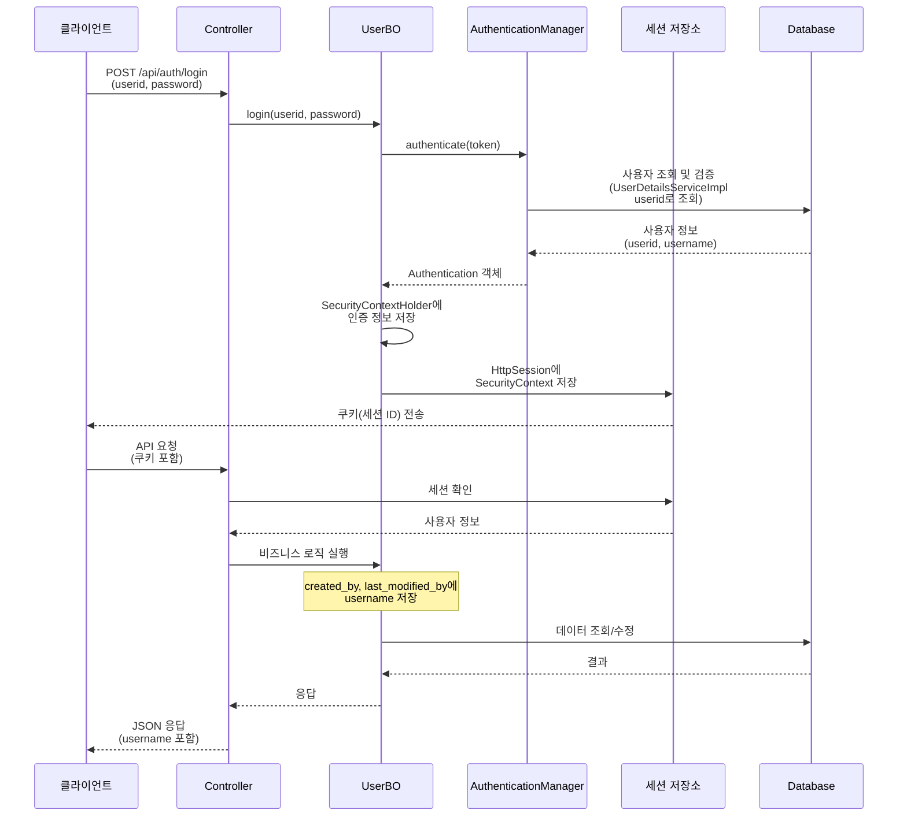
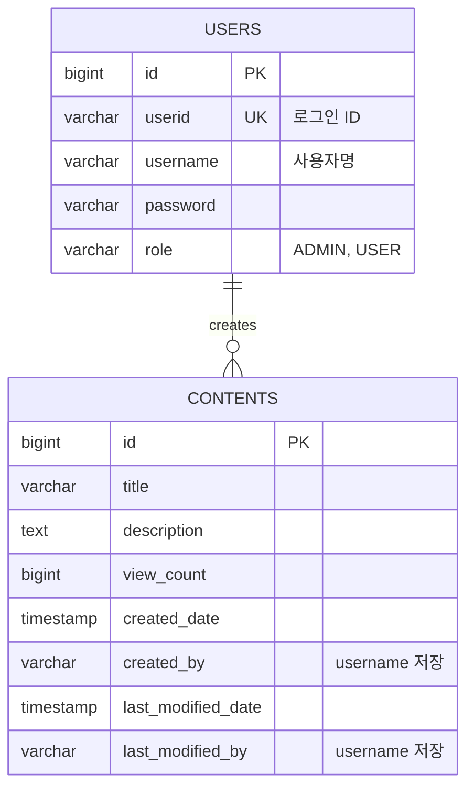

# CMS Backend API

2026 신입 Back-End 개발자 코딩 과제 - 간단한 CMS REST API

## 기술 스택

- **Java 25**
- **Spring Boot 4.0.3**
- **Spring Security** (인증 및 권한 관리)
- **Spring Data JPA** (데이터베이스 접근)
- **H2 Database** (파일 기반, 영구 저장)
- **Lombok** (보일러 코드 감소)
- **Session 기반 인증**
  - Spring Security 기본 세션 인증
  - 쿠키 기반 세션 관리
- **Bootstrap 5** (프론트엔드 UI)

## 프로젝트 실행 방법

### 1. 빌드
```bash
./gradlew build
```

### 2. 실행
```bash
./gradlew bootRun
```

애플리케이션은 `http://localhost:8080`에서 실행됩니다.

### 초기 계정

프로젝트 실행 시 다음 계정이 자동으로 생성됩니다 (`DataInitializer`에 의해):

- **Admin 계정**
  - UserID: `admin` (로그인 ID)
  - Username: `관리자` (사용자명)
  - Password: `password`
  - Role: `ADMIN`
  - 권한: 모든 콘텐츠 수정/삭제 가능

- **User 계정**
  - UserID: `user1`, `user2` (로그인 ID)
  - Username: `사용자1`, `사용자2` (사용자명)
  - Password: `password`
  - Role: `USER`
  - 권한: 본인이 작성한 콘텐츠만 수정/삭제 가능

> **참고**: 
> - **UserID**: 로그인 시 사용하는 고유 ID (필수)
> - **Username**: 화면에 표시되는 사용자명 (선택사항, 없으면 UserID 표시)

> **참고**: 계정이 이미 존재하면 자동 생성되지 않습니다. 데이터베이스 파일(`./data/cmsdb.mv.db`)을 삭제하면 초기화됩니다.

## 구현 내용 / 추가 구현 기능

### 주요 기능

#### 인증 및 권한 관리
- **Session 기반 인증**
  - Spring Security 기본 세션 인증 방식
  - 쿠키 기반 세션 관리 (브라우저 자동 처리)
  - 세션에 사용자 인증 정보 저장
  - 모든 API 요청 시 쿠키(세션 ID) 자동 포함
- **UserID와 Username 분리**
  - **UserID**: 로그인 시 사용하는 고유 ID (필수, unique)
  - **Username**: 화면에 표시되는 사용자명 (선택사항)
  - Spring Security는 UserID를 사용하여 인증 처리
  - 콘텐츠의 `created_by`, `last_modified_by`에는 Username만 저장
- **Role 기반 권한 관리** (ADMIN, USER)
- **회원가입 및 로그인** 기능 (UserID로 로그인)
- **로그아웃** 기능
- **UserID 중복 확인** API

#### 콘텐츠 관리
- 콘텐츠 CRUD 작업
- 페이징 지원 (페이지 번호 버튼 포함)
- 조회수 자동 증가 기능
- 작성자/수정자 정보 자동 기록
  - `created_by`: 콘텐츠 생성 시 현재 로그인한 사용자의 Username 저장
  - `last_modified_by`: 콘텐츠 수정 시 현재 로그인한 사용자의 Username 저장
  - 조회수 증가 시 `last_modified_by`는 변경되지 않음
- 권한 기반 접근 제어:
  - 작성자 본인만 수정/삭제 가능
  - ADMIN은 모든 콘텐츠 수정/삭제 가능
  - 프론트엔드에서 권한에 따라 버튼 표시/숨김

#### 프론트엔드
- Bootstrap 5 다크 모드 UI
- 반응형 디자인
- 로그인 상태에 따른 네비게이션 바 자동 업데이트
- 로그인한 사용자 인사말 표시 ("~님 안녕하세요")
- 권한에 따른 Edit/Delete 버튼 표시 제어
- 페이징 UI (페이지 번호, Previous/Next 버튼)
- 작성자 컬럼에 Username 표시 (UserID가 아닌 사용자명)

#### 예외 처리
- 전역 예외 처리 (`GlobalExceptionHandler`)
- 커스텀 예외 클래스
  - `ResourceNotFoundException` (404)
  - `UnauthorizedException` (403)
  - `UserNotFoundException` (404)
  - `UsernameAlreadyExistsException` (409)
- 표준화된 에러 응답 형식

#### 기술적 해결 사항
- **순환 참조 해결**: `UserBO`와 `AuthenticationManager` 간 순환 참조를 `@Lazy` 어노테이션과 `UserDetailsServiceImpl` 분리로 해결
- **세션 생성**: 로그인 시 `SecurityContextHolder`와 `HttpSessionSecurityContextRepository`를 사용하여 세션에 인증 정보 저장
- **viewCount 기본값 처리**: 콘텐츠 생성 시 `viewCount`가 null인 경우 자동으로 0으로 설정
- **UserID와 Username 분리**: 
  - `UserDetails.getUsername()`은 Spring Security 호환을 위해 UserID를 반환
  - 실제 사용자명은 `getActualUsername()` 메서드로 접근
  - 콘텐츠의 `created_by`, `last_modified_by`에는 Username만 저장하여 화면에 표시
- **조회수 증가 시 수정일 미변경**: `@Modifying` 쿼리를 사용하여 조회수만 증가시키고 `lastModifiedDate`는 변경되지 않도록 처리

### 아키텍처

본 프로젝트는 **Controller → BO → Repository → Entity** 4계층 구조로 구성되어 있습니다.

```mermaid
graph TB
    Client[클라이언트] --> Controller[Controller]
    Controller --> BO[BO<br/>@Service]
    BO --> Repository[Repository]
    Repository --> DB[(H2 Database)]
    BO --> Entity[Entity<br/>@Data]
    
    subgraph Controller
        PageController[@Controller<br/>HTML 페이지]
        RestController[@RestController<br/>REST API]
    end
    
    subgraph User[User 엔티티]
        UserID[userid<br/>로그인 ID]
        Username[username<br/>사용자명]
    end
    
    Controller -.->|인증 정보| User
    BO -.->|created_by<br/>last_modified_by| Username
    
    style Controller fill:#e1f5ff
    style BO fill:#fff4e1
    style Repository fill:#e8f5e9
    style Entity fill:#fce4ec
    style DB fill:#f3e5f5
    style User fill:#fff9c4
    style UserID fill:#ffccbc
    style Username fill:#c8e6c9
```

- **Controller**: 요청/응답 처리
  - `Controller`: HTML 페이지 제공 (`@Controller`)
  - `RestController`: REST API 엔드포인트 제공 (`@RestController`)
- **BO (Business Object)**: `@Service`로 비즈니스 로직 처리, Repository 직접 호출
- **Repository**: 데이터베이스 접근 (Spring Data JPA)
- **Entity**: `@Data`로 데이터 구조 정의

### 프로젝트 구조 (Feature별 구성)

```mermaid
graph TD
    Root[com.malgn] --> User[user/]
    Root --> Content[content/]
    Root --> Config[config/]
    Root --> Security[security/]
    Root --> Exception[exception/]
    
    User --> UserBO[bo/UserBO.java]
    User --> UserController[controller/UserController.java]
    User --> UserRestController[controller/UserRestController.java]
    User --> UserEntity[entity/User.java]
    User --> UserRepo[repository/UserRepository.java]
    
    Content --> ContentBO[bo/ContentsBO.java]
    Content --> ContentController[controller/ContentController.java]
    Content --> ContentRestController[controller/ContentRestController.java]
    Content --> ContentEntity[entity/Contents.java]
    Content --> ContentRepo[repository/ContentsRepository.java]
    
    Config --> SecurityConfig[security/SecurityConfiguration.java]
    Config --> DataInit[DataInitializer.java]
    
    Security --> UserPrincipal[UserPrincipal.java]
    Security --> UserDetailsService[UserDetailsServiceImpl.java]
    
    Exception --> GlobalHandler[GlobalExceptionHandler.java]
    Exception --> ResourceNotFound[ResourceNotFoundException.java]
    Exception --> Unauthorized[UnauthorizedException.java]
    Exception --> UserNotFound[UserNotFoundException.java]
    Exception --> UsernameExists[UsernameAlreadyExistsException.java]
    
    style User fill:#e1f5ff
    style Content fill:#e1f5ff
    style Config fill:#fff4e1
    style Security fill:#fff4e1
    style Exception fill:#fce4ec
```



**디렉토리 구조:**
```
src/main/java/com/malgn/
├── user/                    # 사용자 관련 기능
│   ├── bo/                  # 비즈니스 로직 (UserBO)
│   │   └── UserBO.java      # @Service - 로그인, 회원가입, 사용자 조회 등
│   ├── controller/          # 컨트롤러
│   │   ├── UserController.java          # @Controller - HTML 페이지 제공
│   │   └── UserRestController.java      # @RestController - REST API
│   ├── entity/              # 엔티티
│   │   └── User.java        # @Data - 사용자 데이터
│   └── repository/          # Repository
│       └── UserRepository.java
│
├── content/                 # 콘텐츠 관련 기능
│   ├── bo/                  # 비즈니스 로직 (ContentsBO)
│   │   └── ContentsBO.java  # @Service - CRUD 비즈니스 로직
│   ├── controller/          # 컨트롤러
│   │   ├── ContentController.java       # @Controller - HTML 페이지 제공
│   │   └── ContentRestController.java   # @RestController - REST API
│   ├── entity/              # 엔티티
│   │   └── Contents.java    # @Data - 콘텐츠 데이터
│   └── repository/          # Repository
│       └── ContentsRepository.java
│
├── config/                  # 설정 클래스
│   ├── security/            # Security 설정
│   │   ├── SecurityConfiguration.java
│   │   ├── H2DbSecurityConfiguration.java
│   │   └── ActuatorSecurityConfiguration.java
│   └── DataInitializer.java # 초기 데이터 생성
│
├── security/                # Security 관련
│   ├── UserPrincipal.java   # UserDetails 구현체
│   └── UserDetailsServiceImpl.java  # UserDetailsService 구현체 (순환 참조 해결)
│
└── exception/               # 예외 처리
    ├── GlobalExceptionHandler.java
    ├── ResourceNotFoundException.java
    ├── UnauthorizedException.java
    ├── UserNotFoundException.java
    └── UsernameAlreadyExistsException.java

src/main/resources/
├── templates/               # HTML 템플릿 파일
│   ├── user/
│   │   ├── login.html
│   │   └── signup.html
│   └── content/
│       ├── contents.html
│       ├── content-new.html
│       ├── content-detail.html
│       └── content-edit.html
└── application.yml          # 애플리케이션 설정
```

### 설계 원칙

```mermaid
graph LR
    A[Controller] -->|Entity 직접 전달| B[BO<br/>@Service]
    B -->|Repository 호출| C[Repository]
    C -->|Entity 반환| D[(Database)]
    B -->|Entity 사용| E[Entity<br/>@Data]
    
    subgraph User[User 엔티티]
        U1[userid<br/>로그인 ID]
        U2[username<br/>사용자명]
    end
    
    subgraph Content[Contents 엔티티]
        C1[created_by<br/>username 저장]
        C2[last_modified_by<br/>username 저장]
    end
    
    B -.->|getActualUsername| U2
    B -.->|setCreatedBy<br/>setLastModifiedBy| C1
    B -.->|setCreatedBy<br/>setLastModifiedBy| C2
    
    style A fill:#e1f5ff
    style B fill:#fff4e1
    style C fill:#e8f5e9
    style E fill:#fce4ec
    style D fill:#f3e5f5
    style User fill:#fff9c4
    style Content fill:#e1bee7
```

1. **Service 레이어 제거**: BO가 비즈니스 로직과 Repository 호출을 모두 담당
2. **DTO 제거**: Controller에서 Entity를 직접 받아 사용
3. **Feature별 패키지 구조**: user, content 등 기능별로 모든 레이어를 묶어 관리
4. **BO는 @Service**: 비즈니스 로직 처리 및 Repository 직접 호출
5. **Entity는 @Data**: 데이터 구조만 정의
6. **순환 참조 해결**: 
   - `UserBO`와 `AuthenticationManager` 간 순환 참조를 `@Lazy` 어노테이션으로 해결
   - `UserDetailsService` 구현을 별도 클래스(`UserDetailsServiceImpl`)로 분리하여 의존성 분리

### 사용자 인증 및 식별

#### UserID와 Username 분리

본 프로젝트는 **UserID(로그인 ID)**와 **Username(사용자명)**을 분리하여 관리합니다.


**구조:**
- **UserID (`userid`)**: 
  - 로그인 시 사용하는 고유 ID (필수, unique, not null)
  - Spring Security의 `UserDetails.getUsername()`이 반환하는 값
  - 예: "admin", "user1"
  
- **Username (`username`)**: 
  - 화면에 표시되는 사용자명 (선택사항, nullable)
  - 콘텐츠의 `created_by`, `last_modified_by`에 저장되는 값
  - 예: "관리자", "사용자1"
  - `User.getActualUsername()` 메서드로 접근

**사용 예시:**
- 로그인: UserID로 로그인 (`admin`, `user1`)
- 화면 표시: Username 표시 (`관리자`, `사용자1`)
- 콘텐츠 작성자: `created_by`에 Username 저장 (`관리자`)

### 로그인 방식

본 프로젝트는 **Session 기반 인증 방식**을 사용하여 인증을 구현했습니다.

**선택한 인증 방식: Session 기반 인증**

**이유:**
- 구현이 간단하고 이해하기 쉬움
- Spring Security의 기본 인증 방식 활용
- 서버에서 세션 관리로 보안 제어 용이
- 웹 브라우저에서 쿠키 기반 자동 처리

**인증 흐름:**



### 데이터베이스 설정

#### 데이터 모델



#### H2 데이터베이스
- **타입**: 파일 기반 (영구 저장)
- **파일 위치**: `./data/cmsdb.mv.db`
- **DDL 모드**: `update` (테이블 자동 생성/업데이트)
- **초기 데이터**: 애플리케이션 시작 시 자동 생성 (`DataInitializer`)

#### H2 Console
개발 환경에서 H2 데이터베이스 콘솔에 접근할 수 있습니다:
- URL: `http://localhost:8080/h2-console`
- JDBC URL: `jdbc:h2:file:./data/cmsdb`
- Username: `sa`
- Password: (비어있음)

> **참고**: 데이터베이스 파일을 삭제하면 모든 데이터가 초기화되고, 다음 실행 시 초기 계정이 다시 생성됩니다.

#### 주요 데이터 필드 설명

**USERS 테이블**
- `userid`: 로그인 시 사용하는 고유 ID (unique, not null)
- `username`: 화면에 표시되는 사용자명 (nullable, 선택사항)
- `password`: 암호화된 비밀번호
- `role`: 사용자 역할 (ADMIN, USER)

**CONTENTS 테이블**
- `created_by`: 콘텐츠 작성자의 **Username** (UserID가 아닌 사용자명 저장)
- `last_modified_by`: 콘텐츠 수정자의 **Username** (UserID가 아닌 사용자명 저장)
- `view_count`: 조회수 (기본값: 0)
- `last_modified_date`: 수정일 (조회수 증가 시에는 변경되지 않음)

### 주요 구현 기능

#### 백엔드
- ✅ **아키텍처: Controller → BO → Repository → Entity 4계층 구조**
  - Service 레이어 제거, BO로 통합
  - Feature별 패키지 구조 (user, content)
  - DTO 제거, Entity 직접 사용
- ✅ **Session 기반 인증 시스템**
  - Spring Security 기본 세션 인증
  - 쿠키 기반 세션 관리
  - 세션에 사용자 인증 정보 저장
- ✅ **BO(Business Object) 패턴**
  - `@Service`로 비즈니스 로직 처리
  - Repository 직접 호출
  - 비즈니스 로직과 데이터 접근 통합
- ✅ **전역 예외 처리** (`GlobalExceptionHandler`)
- ✅ **페이징 처리** (Spring Data JPA Page)
- ✅ **조회수 자동 증가** 기능 (상세 조회 시)
- ✅ **viewCount 기본값 처리** (null인 경우 0으로 자동 설정)
- ✅ **수정자 정보 자동 기록** (`lastModifiedBy` 필드)
- ✅ **Validation**을 통한 입력값 검증
- ✅ **권한 기반 접근 제어** (작성자 본인 또는 ADMIN)
- ✅ **초기 데이터 자동 생성** (`DataInitializer`)
- ✅ **파일 기반 H2 데이터베이스** (데이터 영구 저장)

#### 프론트엔드
- ✅ Bootstrap 5 다크 모드 UI
- ✅ 반응형 디자인
- ✅ 로그인/로그아웃 기능
- ✅ Session 기반 인증 상태 관리
- ✅ 현재 사용자 정보 조회 API (`/api/auth/me`)
- ✅ 로그인한 사용자 인사말 표시 ("~님 안녕하세요")
- ✅ 권한에 따른 버튼 표시 제어
- ✅ 페이징 UI (페이지 번호, Previous/Next)
- ✅ UserID 중복 확인
- ✅ 패스워드 확인 기능
- ✅ 로그인 상태에 따른 네비게이션 바 업데이트
- ✅ 작성자 컬럼에 Username 표시 (UserID가 아닌 사용자명)

## 사용한 AI 도구 또는 참고 자료

- **AI 도구**: Cursor AI Assistant를 사용하여 코드 구조 설계 및 구현 지원
- **참고 자료**: 
  - Spring Boot 4.0 공식 문서
  - Spring Security 공식 문서 (Session 기반 인증)

## REST API 문서

자세한 REST API 문서는 [API.md](./API.md) 파일을 참조하세요.
